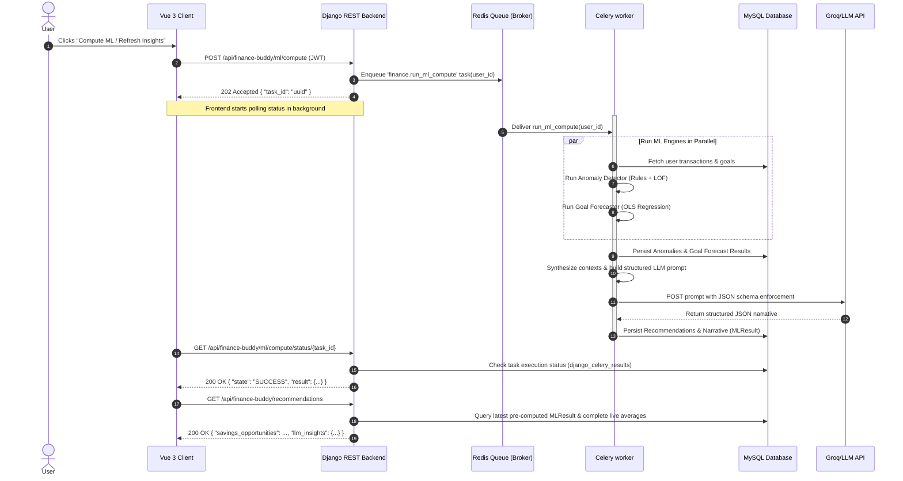
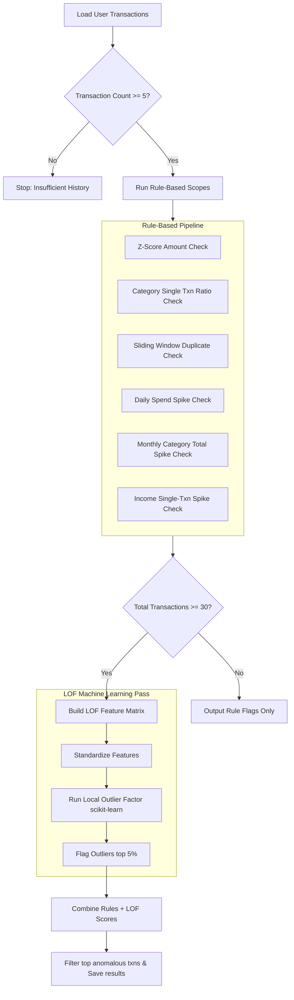
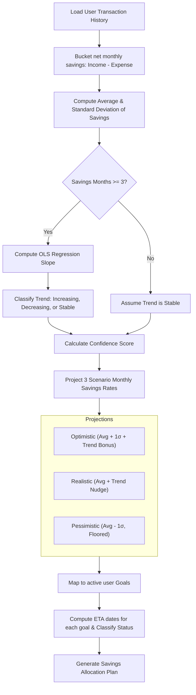
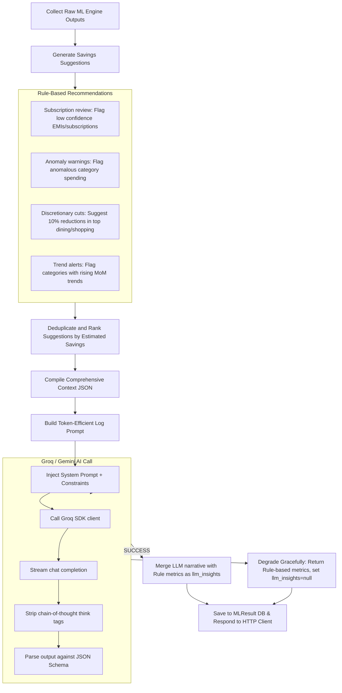
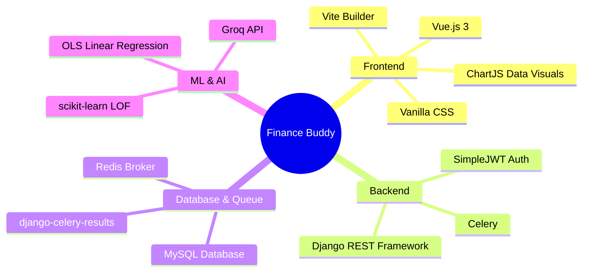

# Finance Buddy 🪙

Finance Buddy is a premium, AI-powered personal finance management and coaching platform. It helps users track transactions, set and monitor financial goals, detect anomalies in spending habits, cluster recurring bills/subscriptions, and receive custom coaching insights.

The core of the application lies in its asynchronous machine learning pipeline. It runs statistical and ML models (like **Local Outlier Factor (LOF)** and **Ordinary Least Squares (OLS) Linear Regression**) in parallel background tasks, then synthesizes the results into structured prompts to generate tailored AI-coaching narratives using an LLM.

---

## Table of Contents
1. [System Architecture](#system-architecture)
2. [Database Schema & Models](#database-schema--models)
3. [Asynchronous ML Processing Pipeline](#asynchronous-ml-processing-pipeline)
4. [Deep Dive: ML Features & Engines](#deep-dive-ml-features--engines)
    - [1. Anomaly Detector](#1-anomaly-detector)
    - [2. Goal Forecaster](#2-goal-forecaster)
    - [3. Recurring Transaction Detector](#3-recurring-transaction-detector)
    - [4. AI Recommendation & Insights Engine](#4-ai-recommendation--insights-engine)
5. [REST API Documentation](#rest-api-documentation)
6. [Tech Stack](#tech-stack)
7. [Installation & Setup Guide](#installation--setup-guide)
    - [Backend Setup](#backend-setup)
    - [Frontend Setup](#frontend-setup)
8. [Directory Structure](#directory-structure)

---

## System Architecture

Finance Buddy follows a decoupled client-server architecture. The frontend is built on **Vue 3** (Vite), which communicates with the **Django REST Framework (DRF)** backend via JWT-authenticated API endpoints.

To prevent long-running computations from blocking the HTTP response thread (which previously caused 10–30+ second timeouts), all heavy ML computations are dispatched to a **Celery** background worker using a **Redis** message broker.

### Sequence Flow of Asynchronous ML Processing
The sequence diagram below shows how the client initiates an ML run, polls for the status, and retrieves the generated recommendations once complete.



---

## Database Schema & Models

The backend utilizes Django models mapped to a **MySQL** database. There are 6 main tables under the `finance` app:

1. **[User](file:///d:/finance/FinanceBuddy/backend/finance/models/base_models.py#L21-L32)**: Extends Django's `AbstractBaseUser` for standard email/username auth.
2. **[Transaction](file:///d:/finance/FinanceBuddy/backend/finance/models/base_models.py#L33-L65)**: Stores financial data.
   - fields: `user`, `title`, `amount`, `transaction_type` (`Income` / `Expense`), `date`, `category` (one of Food/Grocery, Entertainment, EMIs, Health, Rentals, Utilities, etc.).
3. **[Goal](file:///d:/finance/FinanceBuddy/backend/finance/models/base_models.py#L67-L82)**: Stores financial targets.
   - fields: `user`, `name`, `target_amount`, `deadline`, `status` (`current`, `achieved`, `archive`).
4. **[AnomalousTransaction](file:///d:/finance/FinanceBuddy/backend/finance/models/anomaly_model.py#L5-L27)**: Tracks anomalous transactions flagged by the ML pipeline.
   - fields: `user`, `transaction` (FK), `anomaly_score` (0.0 to 1.0), `signals` (JSON payload describing trigger reasons), `period` (`current_month` / `last_3_months`), `is_dismissed` (boolean).
5. **[RecurringTransaction](file:///d:/finance/FinanceBuddy/backend/finance/models/recurring_txn_model.py#L4-L38)**: Holds detected subscription/bill clusters.
   - fields: `user`, `title`, `amount`, `interval_bucket` (`15_days`, `30_days`, `90_days`), `mean_gap_days`, `confidence` (0.0 to 1.0), `next_expected_date`, `recurring_type` (Rent, Subscription, EMI, Bill, etc.), `occurrences`.
6. **[MLResult](file:///d:/finance/FinanceBuddy/backend/finance/models/ml_result_model.py#L5-L27)**: A generic JSON repository that caches the results of computation runs.
   - fields: `user`, `feature` (`recurring`, `anomaly`, `forecast`, `recommendation`), `result` (JSONField), `status` (active/old boolean), `computed_at`.

---

## Asynchronous ML Processing Pipeline

The orchestrator tasks are defined in **[tasks.py](file:///d:/finance/FinanceBuddy/backend/finance/tasks.py)**:
- **`run_ml_compute(user_id)`**:
  - Automatically triggered asynchronously when a user posts to `/api/finance-buddy/ml/compute`.
  - Spawns independent sub-processes using a Python `ThreadPoolExecutor` (with `max_workers=3`) to run the **Anomaly Detector** and **Goal Forecaster** concurrently.
  - Updates the Django database by performing bulk upserts/updates on `AnomalousTransaction` and inserting raw outputs into `MLResult`.
  - Gathers the generated results, performs a localized DB query to pre-fetch 12 months of historical transaction rows, and feeds them into the **AI Recommendation Engine**.
  - Triggers the LLM client to request a structured text coaching narrative based on the results, caching the final recommendations in the `MLResult` table under `feature='recommendation'`.

---

## Deep Dive: ML Features & Engines

Here is how each analytical engine computes results from the raw transaction data.

---

### 1. Anomaly Detector

**Source Code**: [anomaly_detector.py](file:///d:/finance/FinanceBuddy/backend/ml_utils/anomaly_detector.py)

The anomaly detector uses a hybrid model comprising **rule-based statistical checks** and a **density-based machine learning pass** using **Local Outlier Factor (LOF)**.

#### Pipeline Flow:


#### Explaining the Checks:
*   **Z-Score check**: Evaluates whether an individual transaction's amount deviates significantly from the user's overall transaction mean:
    $$\text{Z-Score} = \frac{x_i - \mu}{\sigma}$$
    Transactions with a Z-score greater than `Z_SCORE_THRESHOLD = 2.0` are flagged.
*   **Category Single Ratio**: Triggers if a single transaction is responsible for $>50\%$ of the monthly average spending of its category.
*   **Duplicate Sliding Window**: Flags a pattern if identical transactions (same description and amount) repeat $\ge 3$ times in a sliding `REPEAT_WINDOW_DAYS = 7` window.
*   **Daily Spike Check**: Flags transactions that exceed 3x the user's historical rolling daily spending average.
*   **Monthly Category Spike**: Evaluates the current calendar month category total against prior historical monthly averages. Flags the category if spend doubles ($>2.0\text{x}$ prior averages).
*   **LOF Pass (Local Outlier Factor)**:
    - Encodes date and context parameters into a 7-dimensional feature matrix: `[Amount, Weekday, Day-of-month, Encoded Category, Days-since-previous, Amount-vs-Category-avg-ratio, Cumulative-monthly-category-spend]`.
    - Normalizes the matrix via `StandardScaler`.
    - Fits the unsupervised `Local OutlierFactor(n_neighbors=10, contamination=0.05)` algorithm to flag transactions resting in low-density density clusters (outliers).

---

### 2. Goal Forecaster

**Source Code**: [goal_forecaster.py](file:///d:/finance/FinanceBuddy/backend/ml_utils/goal_forecaster.py)

The goal forecaster evaluates whether a user can hit their financial deadlines using historical net savings rates and **Ordinary Least Squares (OLS) Linear Regression**.

#### Pipeline Flow:


#### Math & Formula Breakdown:
1.  **Trend Slope (OLS Regression)**: Calculates the trend line slope ($m$) of monthly net savings:
    $$m = \frac{\sum_{i=1}^{n} (i - \bar{x})(y_i - \bar{y})}{\sum_{i=1}^{n} (i - \bar{x})^2}$$
    Where $y_i$ represents the net savings of month $i$, and $x$ is the zero-based chronological month index.
2.  **Trend Classification**:
    - **Increasing**: If $\frac{m}{|\text{average}|} > 0.05$ ($+5\%$ MoM increase)
    - **Decreasing**: If $\frac{m}{|\text{average}|} < -0.05$ ($-5\%$ MoM decrease)
    - **Stable**: Otherwise
3.  **Confidence Score**: Evaluates the variance of savings relative to the average:
    $$\text{Confidence} = 1.0 - \frac{\sigma_{\text{savings}}}{\mu_{\text{savings}}}$$
    It is capped between $0.0$ and $1.0$. Higher standard deviations lower the confidence indicator.
4.  **Scenario Rates**:
    - **Optimistic**: $\mu + 1\sigma$ (plus $+5\%$ extra trend bonus if trend is increasing).
    - **Realistic**: $\mu$ (nudged $\pm 5\%$ by trend direction).
    - **Pessimistic**: $\mu - 1\sigma$ (floored at $10\%$ of $\mu$ to avoid infinite negative debt projection).
5.  **Goal Classification**:
    - `achieved`: Saved amount $\ge$ Target.
    - `on_track`: Realistic rate completes the target before the deadline.
    - `at_risk`: Realistic rate fails, but Optimistic rate meets the goal.
    - `off_track`: Optimistic rate fails to meet the goal in time.
    - `deadline_passed`: Goal target not reached and deadline is in the past.

---

### 3. Recurring Transaction Detector

**Source Code**: [recurring_detector.py](file:///d:/finance/FinanceBuddy/backend/ml_utils/recurring_detector.py)

Clusters historical transaction records to identify systematic, repeating intervals (like rent, salary, utilities, or streaming subscriptions).

#### Mathematical Model:
*   **Clustering**: Transactions are clustered by matching description tokens (e.g. normalizing `Netflix.com` and `Netflix` to the same stem) and exact decimal `amount`.
*   **Minimum Threshold**: The cluster must contain $\ge 3$ instances.
*   **Gap Regularity**: Let $D = [d_1, d_2, \dots, d_n]$ be the sorted dates of the transactions. Gaps between transactions are calculated as $G = [g_1, g_2, \dots, g_{n-1}]$ where $g_i = d_{i+1} - d_i$ in days.
    The mean gap $\mu_g$ and standard deviation $\sigma_g$ are calculated. Regularity is measured using the **Coefficient of Variation (CV)**:
    $$CV = \frac{\sigma_g}{\mu_g}$$
    If $CV > 0.15$ ($15\%$), the cycle is considered too irregular and discarded.
*   **Interval Bucketing**:
    - `15_days`: Mean gap is between $10$ and $22$ days.
    - `30_days`: Mean gap is between $23$ and $60$ days.
    - `90_days`: Mean gap is between $61$ and $120$ days.

---

### 4. AI Recommendation & Insights Engine

**Source Codes**: [recommendation_engine.py](file:///d:/finance/FinanceBuddy/backend/ml_utils/recommendation_engine.py), [llm_client.py](file:///d:/finance/FinanceBuddy/backend/ml_utils/llm_client.py), [recommendation_prompt.py](file:///d:/finance/FinanceBuddy/backend/ml_utils/prompts/recommendation_prompt.py)

This engine acts as a synthesis compiler. It consolidates computed rule flags, anomaly metrics, and goal status data, passes them to a generative LLM layer, and returns a tailored financial coaching dashboard.

#### Pipeline Flow:


#### The LLM Prompt Design:
Rather than sending long, noisy JSON structures, the prompt builder in `recommendation_prompt.py` compresses the context into a dense, log-like format:
```text
USER: Aarav | acct_age=12mo | date=2026-07-23
SNAPSHOT: income=₹50,000/mo expense=₹32,000/mo this_month=₹14,500 months=12

SAVINGS RECS (total potential: ₹3,000/mo):
  [0] Review 'Netflix' subscription | save=₹199/mo | pri=medium | type=subscription_review
  [1] Unusual spending in 'Dining' | save=₹1,500/mo | pri=high | type=anomaly_reduction

TOP SPEND:
  Food/Grocery: avg=₹8,000/mo now=₹9,500 MoM=+18% trend=rising

GOALS: avg_savings=₹18,000/mo trend=increasing achievable=2/3
  id=1 | name="Emergency Fund" | target=₹50,000 | progress=68% | status=on_track | req=₹5,000/mo
```
This density reduces prompt token overhead and guides the LLM to follow the grounding rules (i.e. strictly using the provided calculations and avoiding hallucinated figures).

---

## REST API Documentation

All request and response objects are serialized using **Django REST Framework Serializers**.

| HTTP Method | Route | Auth | Description |
| :--- | :--- | :---: | :--- |
| `POST` | `/api/finance-buddy/register` | None | Register a new user account. |
| `POST` | `/api/finance-buddy/login` | None | Authenticate credentials and return JWT tokens. |
| `POST` | `/api/token/` | None | Obtain a JWT token pair (Access/Refresh). |
| `POST` | `/api/token/refresh/` | None | Refresh an expired access token. |
| `GET` | `/api/finance-buddy/dashboard` | JWT | Get current user's general metrics (balance, transaction totals, recent lists). |
| `POST` | `/api/finance-buddy/transaction` | JWT | Create a new transaction. |
| `GET` | `/api/finance-buddy/transaction/list` | JWT | List all user transactions. |
| `POST` | `/api/finance-buddy/transaction/bulk` | JWT | Bulk upload transactions (CSV/JSON array). |
| `POST` | `/api/finance-buddy/goal` | JWT | Add a financial savings goal. |
| `GET` | `/api/finance-buddy/goal/list` | JWT | List all user financial goals. |
| `GET` | `/api/finance-buddy/anomalies` | JWT | Retrieve detected anomaly records. |
| `GET` | `/api/finance-buddy/goal/forecast` | JWT | Get projection scenarios for active goals. |
| `GET` | `/api/finance-buddy/recommendations` | JWT | Retrieve computed recommendations and the AI coaching narrative. |
| `POST` | `/api/finance-buddy/ml/compute` | JWT | **Trigger ML run**: Enqueues celery task and returns a `task_id`. |
| `GET` | `/api/finance-buddy/ml/compute/status/<task_id>` | JWT | **Poll ML run**: Check worker status (`PENDING`, `STARTED`, `SUCCESS`, `FAILURE`). |

---

## Tech Stack



---

## Installation & Setup Guide

Ensure you have **Python 3.10+**, **Node.js 18+**, **MySQL Server 8.0+**, and **Docker** installed on your system.

### Backend Setup

1.  **Clone & Navigate to Backend**:
    ```bash
    cd FinanceBuddy/backend
    ```
2.  **Create and Activate Virtual Environment**:
    ```bash
    python -m venv venv
    # Windows Command:
    .\venv\Scripts\activate
    # macOS/Linux Command:
    source venv/bin/activate
    ```
3.  **Install Required Libraries**:
    ```bash
    pip install -r requirements.txt
    ```
4.  **Configure Environment Variables (`.env`)**:
    Create a `.env` file in the `backend/` directory:
    ```ini
    DB_ENGINE="django.db.backends.mysql"
    DB_HOST=localhost
    DB_USER="your_mysql_username"
    DB_PASSWORD="your_mysql_password"
    DB_NAME="finance"
    DB_PORT=3306
    DB_CONNECTION=True
    ENV_NAME='local'
    
    # Configure Groq / Gemini credentials
    GROQ_API_KEY=your-groq-or-gemini-api-key-here
    GROQ_MODEL=openai/gpt-oss-120b
    
    # Configure Redis Broker URL
    CELERY_BROKER_URL=redis://localhost:6379/0
    ```
5.  **Run Database Migrations**:
    ```bash
    python manage.py migrate
    python manage.py migrate django_celery_results
    ```
6.  **Create Django Superuser**:
    ```bash
    python manage.py createsuperuser
    ```
7.  **Run Redis Broker via Docker**:
    Ensure Docker is running, then start Redis:
    ```bash
    docker compose up -d
    ```
8.  **Launch Celery Worker**:
    Open a new terminal, activate the virtual environment, and run:
    ```bash
    # Windows requires the solo pool:
    celery -A financeBuddy worker --loglevel=info --pool=solo
    # macOS/Linux:
    celery -A financeBuddy worker --loglevel=info
    ```
9.  **Launch Django Web Server**:
    In your first terminal, start the server:
    ```bash
    python manage.py runserver
    ```

---

### Frontend Setup

1.  **Navigate to Frontend Directory**:
    ```bash
    cd FinanceBuddy/frontend
    ```
2.  **Install npm packages**:
    ```bash
    npm install
    ```
3.  **Run Development Server**:
    ```bash
    npm run dev
    ```
    The frontend client will now be accessible at `http://localhost:5173`.

---

## Directory Structure

```text
FinanceBuddy/
├── backend/
│   ├── manage.py
│   ├── requirements.txt
│   ├── docker-compose.yml
│   ├── .env
│   ├── financeBuddy/
│   │   ├── __init__.py
│   │   ├── celery.py
│   │   ├── settings.py           # Core configurations & simple_jwt settings
│   │   └── urls.py               # Main URL mappings (includes api/finance-buddy/)
│   ├── finance/
│   │   ├── tasks.py              # Celery background tasks
│   │   ├── urls.py               # Finance app API URL paths
│   │   ├── models/               # Django models (User, Transaction, Goal, Anomaly, etc.)
│   │   └── views/                # API request views (ML compute, dashboard, etc.)
│   ├── serializers/              # DRF serializers
│   └── ml_utils/                 # Analytical & ML engines
│       ├── anomaly_detector.py   # Statistical anomaly flags & LOF model
│       ├── goal_forecaster.py    # OLS linear regression & scenario projection
│       ├── recurring_detector.py # Gap CV check & recurring transaction clusters
│       ├── recommendation_engine.py # Insight synthesizer & prompt loader
│       ├── llm_client.py         # LLM API request execution
│       └── prompts/
│           └── recommendation_prompt.py # System prompts & response schemas
└── frontend/
    ├── package.json
    ├── vite.config.js
    ├── index.html
    ├── public/
    └── src/
        ├── App.vue               # Main entry template
        ├── main.js
        ├── style.css             # Main styling system
        └── components/           # Vue UI templates (Metrics, AnomalyCard, etc.)
```
